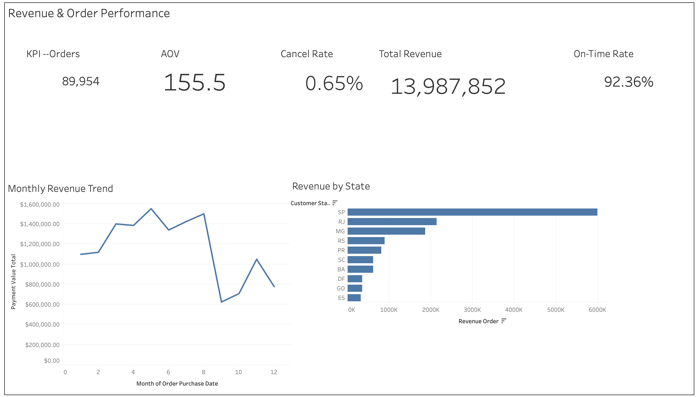

# E-Commerce-Sales

## Status

- Data engineering + KPI-ready layer complete (~90%)
- Tableau dashboard build in progress (screenshots will be added by me)

## Project Goal

Build an end-to-end e-commerce analytics pipeline with:

- Clean, well-defined data grains

- KPI-consistent fact tables

- Tableau-ready data sources

- Business-oriented insights for performance review

## KPI Framework
### North-Star Metric
- Revenue
### Driver KPIs
- Order Volume

- Average Order Value (AOV)

- Cancellation Rate

- On-time Delivery Rate

Revenue changes are decomposed into volume-driven vs value-driven effects to support operational decision-making.
## Data Model

- `fact_orders` (order grain)
- `fact_order_items` (item grain)
- `dim_date` (daily grain)

## Tableau Data Sources

- Data Source A (Order-level): `fact_orders` + `dim_date`
  - Join: `fact_orders.order_purchase_date = dim_date.date_id`
- Data Source B (Item-level): `fact_order_items` + `dim_date`
  - Join: `fact_order_items.order_date = dim_date.date_id`

Rules:
- Order KPIs only from `fact_orders`.
- Product contribution only from `fact_order_items`.

## Outputs (CSV)

- `data/mart/fact_orders.csv`
- `data/mart/fact_order_items.csv`
- `data/mart/dim_date.csv`

## Postgres (Materialized)

Tables:
- `fact_orders`, `fact_order_items`, `dim_date`, plus `raw_*`

## How to Reproduce (Python)

- Build order fact: `python src/transform.py`
- Build item fact: `python src/transform_items.py`
- Build date dim: `python src/build_dim_date.py`

## SQL (Postgres)

- DDL: `sql/ddl/*.sql`
- Transforms: `sql/transform/*.sql`
- Checks: `sql/checks/*.sql`

## Docs

- Data quality: `docs/data_quality_report.md`
- SQL checks: `docs/sql_checks_report.md`
- Metrics dictionary: `docs/metrics_dictionary.md`
- Dashboard walkthrough: `docs/dashboard_walkthrough.md`
- Tableau notes: `tableau/data_source_notes.md`

## Insights
### Revenue concentration:
- Revenue is highly concentrated in a small number of states, with São Paulo (SP), Rio de Janeiro (RJ), and Minas Gerais (MG) contributing the majority of total revenue. This indicates strong regional dependency and potential geographic risk.
### Order economics:
- Average Order Value (AOV) remains stable at approximately 155, suggesting mature pricing behavior and limited short-term upside from price-based growth.
### Operational quality:
- The on-time delivery rate exceeds 92%, indicating generally reliable fulfillment operations. The cancellation rate is low (0.65%), but at scale still represents non-trivial revenue loss.
### Seasonality:
- Monthly revenue exhibits clear volatility and seasonality rather than steady growth, highlighting predictable demand fluctuations throughout the year.
## Opportunity Sizing & Business Implications
### Growth levers:
- With AOV largely stable, revenue growth is primarily driven by order volume expansion rather than pricing adjustments.

### Regional expansion:
- Targeted growth initiatives in mid-performing states could generate meaningful incremental revenue while reducing over-reliance on top regions.

### Operational improvement:
- Even modest reductions in cancellation rates would recover revenue at scale without major structural changes.

### Planning optimization:
- Improved seasonal planning and demand smoothing could mitigate revenue dips during low-demand periods and improve overall revenue stability.
## Dashboard

- Tableau workbook:`tableau/olist_dashboard.twbx`
- Dashboard screenshots: 

